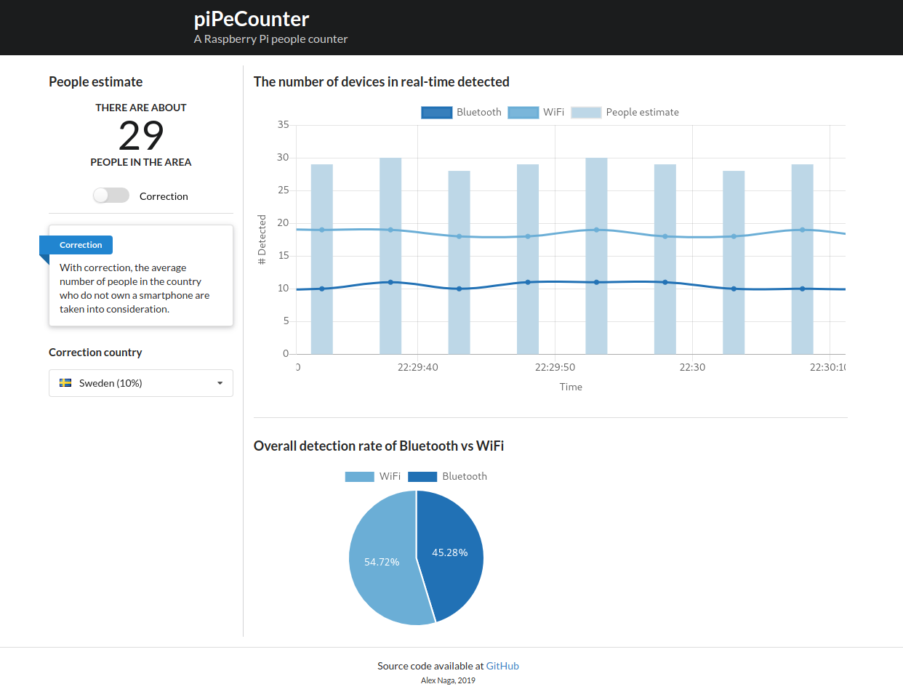

# piPeCounter - A Raspberry Pi people counter

Real-time application for estimating the number of people in an area using Bluetooth and WiFi signals.



## Installation

The setup instructions are based on _Raspbian Buster_, as this project aims for a _Raspberry Pi Zero W_ as platform.

## Prerequisites

To run this application some prerequisites must be met.

### Monitor mode

In order to be able to put the Raspberry Pi's onboard WiFi into _monitor mode_ to scan the air, one need to replace the kernel driver shipped with Raspbian by the driver from the [nexmon](https://github.com/seemoo-lab/nexmon) project.
Unfortunately, one need to compile the driver by oneself.
The compilation and installation process is well described in the project's [README](https://github.com/seemoo-lab/nexmon#build-patches-for-bcm43430a1-on-the-rpi3zero-w-or-bcm434355c0-on-the-rpi3rpi4-using-raspbian-recommended) file.
Follow all the given steps for chipset _bcm43455c0_ (not _bcm43430a1_) driver.

Upon success of the driver installation, set up the monitoring interface `wlan0mon`:

```bash
sudo iw phy $(iw dev wlan0 info | gawk '/wiphy/ {printf "phy" $2}') interface add wlan0mon type monitor
sudo ifconfig wlan0mon up
```

One can test ones effort by scanning the air at once:

```bash
sudo tcpdump -i wlan0mon
```

### Dependencies

Initially, [Pipenv](https://pipenv-fork.readthedocs.io/) is used for management of virtual python environments, so you don't mess up your system's python installation.

```bash
# For pipenv
sudo apt-get install python3-setuptools pipenv
```

Because this project takes advantage of the Bluetooth stack, a few development dependencies must be met.
As they don't come precompiled, they need to be compiled. Please, be patient as this will take some time…
See also [Installation of pybluez on Raspberry Pi 3](https://github.com/pybluez/pybluez/wiki/Installation-on-Raspberry-Pi-3)

```bash
# For pybluez
sudo apt-get install libbluetooth-dev python-dev libglib2.0-dev libboost-python-dev libboost-thread-dev
```

Clone the repository and install all dependencies by _Pipenv_ for the server and the scanner, respectively.
As this process will surely take a while… a timeout may occur.
To get around that issue, increase the timeout (by setting the environment variable [PIPENV_TIMEOUT](https://pipenv.pypa.io/en/latest/advanced/#id1) to five minutes), which should be sufficient.

```bash
git clone https://github.com/AlexNaga/rpi-people-counter.git

export PIPENV_TIMEOUT=300   # Five minutes in seconds

# Install dependencies for the server
cd rpi-people-counter/server
pipenv install

# Install dependencies for the scanner
cd ../scanner
pipenv install
```

### Data storage

[MongoDB](https://www.mongodb.com/) is used to store sensor data.

```bash
sudo apt-get install mongodb
```

After installation, make sure the database service (MongoDB) is up and running.

```bash
systemctl status mongodb.service
```

Optionally, start and enable the service, if it is not already done by the installation process.

```bash
sudo systemctl start mongodb.service
sudo systemctl enable mongodb.service
```

### MQTT broker

[Mosquitto](https://mosquitto.org/) is an open source message broker that implements the MQTT protocol.

```bash
sudo apt-get install mosquitto
```

After installation, make sure the service (Mosquitto MQTT) is up and running.

```bash
systemctl status mosquitto.service
```

Optionally, start and enable the service, if it is not already done by the installation process.

```bash
sudo systemctl start mosquitto.service
sudo systemctl enable mosquitto.service
```

## Getting started

### Running the server

1.  Go to the server folder:
`cd rpi-people-counter/server`
2.  Make a copy of the configuration file:
`cp config/config.ini.example config/config.ini`
…and change the database credentials (if needed).
3.  Then run:

```bash
pipenv run gunicorn run:gunicorn_app --workers=1 --worker-class gevent --bind localhost:8000
```

### Running the scanner

1.  Go to the scanner folder:
`cd rpi-people-counter/scanner`
2.  Make a copy of the configuration file: `cp config/config.ini.example config/config.ini`
3.  Then run:

```bash
pipenv run python main.py
```

## Architecture

**System overview**


**Scanner view**


**Server-side view**


**Client-side view**


